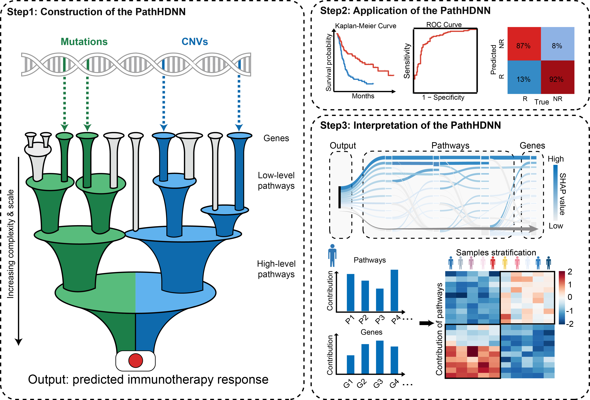
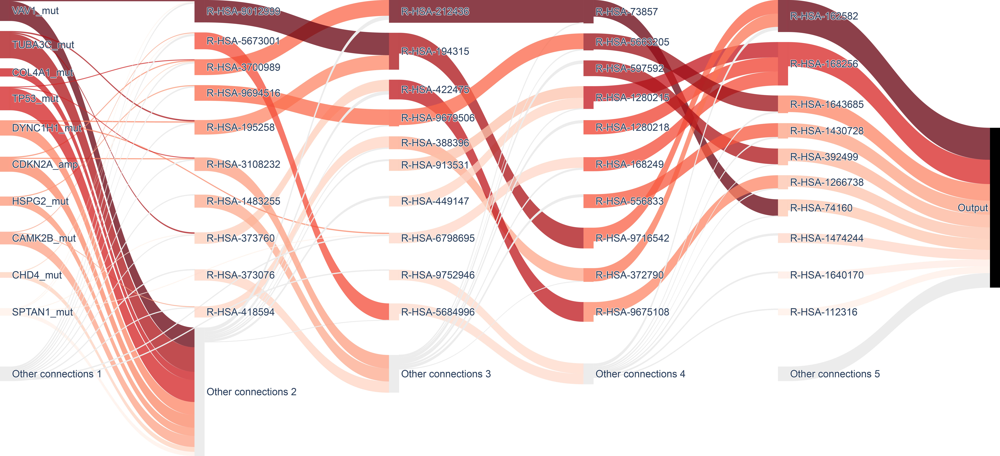
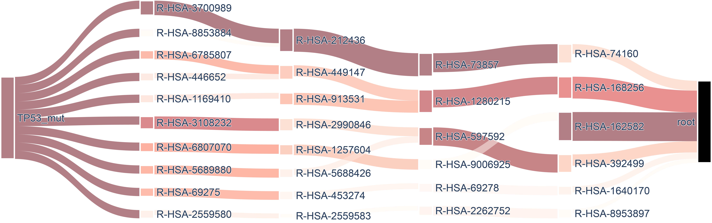

# PathHDNN - A pathway hierarchical-informed deep neural network framework for predicting immunotherapy response and mechanism interpretation
-----------------------------------------------------------------
Code by **Xiangmei Li**, **Bingyue Pan**, and **Junwei Han** at Harbin Medical University.
This repository contains source code and data for **PathHDNN** 

## 1. Introduction

**PathHDNN** is a pathway hierarchical-informed deep neural network (PathHDNN) framework to predict the therapeutic responses of cancer patients and identify key pathways associated with immunotherapy efficacy.
The PathHDNN facilitates the construction of a sparse neural network utilizing a pathway and input data. Documentation examples leverage the Reactome pathway database along with a genomic dataset for neural network generation. This tool not only enables training and network interpretation through SHAP but also offers plotting capabilities for creating sankey diagrams.

## 2. Design of PathHDNN



Figure 1: Overall architecture of PathHDNN

## 3. Installation

**PathHDNN** relies on [Python (version 3.9.13)](https://www.python.org/downloads/release/python-390/) environments, the other configuration management was present in **'config.yaml'**

## 4. Usage

This study trained **PathHDNN** models for different immunotherapy inhibitors separately. All the codes and data required to execute **PathHDNN** are provided in this GitHub repository. Please make sure to replace the input data path in the code with your own storage location.

**1. Code**: The complete code for **PathHDNN** is located at folder ``PathHDNN/``.
| File                              | Description                                                                   |
|------------------------------------|------------------------------------------------------------------------|
| binn.py                             | Construction of pathway-hierarchial neural network                            |
| model_explain.py                           | Interpretability analysis|
| importance_network.py                           | Construction of importance network                             |
| DataProcessing.R                           | Data pre-processing                             |
| train_PathHDNN.py | Train the PathHDNN model                                       |
| plot_code.R | Results visualization                                       |
| Comparative algorithm | Implementation of the Comparative Algorithm                                       |

**2. Data**: The datasets used to train **PathHDNN** are located at folder ``data/``
| File                              | Description                                                                   |
|------------------------------------|------------------------------------------------------------------------|
| ReactomePathways.txt                             | Gene-pathway relationship                            |
| pathways.tsv                           | Hierarchical structure of reactome pathways|
| SKCM144/110/60/30                           | The original data of four immunotherapy datasets                             |
| ./SKCM144/pre-processing | The pre-processing data of four immunotherapy datasets                                       |
| pre-trained model | The pre-trained model for different ICI type                                       |

**3. Output**: Get the best trained model. The models used in this paper are located at folder ``data/``,named ``pre-trained model/``.
```sh
from binn import BINN, Network, SuperLogger,BINNExplainer,ImportanceNetwork;
import pandas as pd;
from sklearn import preprocessing;
import numpy as np;
from typing import Union;
import torch;
from pytorch_lightning import Trainer
import torch.nn.functional as F
from sklearn.metrics import roc_curve,auc
import matplotlib.pyplot as plt
import joblib

def fit_data_matrix_to_network_input(data_matrix: pd.DataFrame, features, feature_column="Protein") -> pd.DataFrame:
    nr_features_in_matrix = len(data_matrix.index)
    if len(features) > nr_features_in_matrix:
        features_df = pd.DataFrame(features, columns=[feature_column])
        data_matrix = data_matrix.merge(
            features_df, how='right', on=feature_column)
    if len(features) > 0:
        data_matrix.set_index(feature_column, inplace=True)
        data_matrix = data_matrix.loc[features]
    return data_matrix


def generate_data(data_matrix: pd.DataFrame, design_matrix: pd.DataFrame):
    GroupOneCols = design_matrix[design_matrix['group']
                                 == 0]['sample'].values
    GroupTwoCols = design_matrix[design_matrix['group']
                                 == 1]['sample'].values

    df1 = data_matrix[GroupOneCols].T
    df2 = data_matrix[GroupTwoCols].T
    y = np.array([0 for _ in GroupOneCols] + [1 for _ in GroupTwoCols])
    X = pd.concat([df1, df2]).fillna(0).to_numpy()
    X = preprocessing.StandardScaler().fit_transform(X)
    return X, y


input_data = pd.read_csv("./data/SKCM144/pre-processing/brca_maf13.txt",sep="\t",header=0);
translation = pd.read_csv("./data/SKCM144/pre-processing/reactome_data13.txt",sep="\t");
pathways = pd.read_csv("./data/pathways.tsv", sep="\t");

network = Network(input_data=input_data,pathways=pathways,mapping=translation,input_data_column = "Protein",source_column = "child",target_column = "parent")

torch.manual_seed(0)
binn = BINN(network=network,n_layers=4,dropout=0.5,validate=True,residual=False,learning_rate=0.001)
design_matrix = pd.read_csv('./data/SKCM144/pre-processing/sample_data13.txt',sep="\t")
protein_matrix = fit_data_matrix_to_network_input(input_data, features=binn.features)
X, y = generate_data(protein_matrix, design_matrix=design_matrix)
dataset = torch.utils.data.TensorDataset(torch.tensor(X, dtype=torch.float64),torch.tensor(y, dtype=torch.float64))
torch.manual_seed(0)
dataloader = torch.utils.data.DataLoader(dataset, batch_size=36, shuffle=True,drop_last=False,num_workers=0)

a=tuple([tuple(e) for e in X])
optimizer = binn.configure_optimizers()[0][0]
num_epochs =10000
avg_loss_all = [];avg_auc_all = [];avg_auc_all1 = [];avg_auc_all2 = [];avg_auc_all3 = []
i=0
torch.manual_seed(0)
for epoch in range(num_epochs):
    i=i+1
    if (i%1000) ==0:
        print(i)
    binn.train() 
    total_loss = 0
    total_auc = 0
    for batch_idx, (inputs, targets) in enumerate(dataloader):
        inputs = inputs.to(binn.device).type(torch.float32)
        targets = targets.to(binn.device).type(torch.LongTensor)
        optimizer.zero_grad()
        output = binn(inputs).to(binn.device)
        loss = F.cross_entropy(output, targets)
        loss.backward()
        optimizer.step()
        total_loss = total_loss + loss.item()
        outputs=output[:,1].detach().numpy()
        fpr,tpr,thersholds=roc_curve(targets, outputs)
        roc_auc= auc(fpr,tpr)
        total_auc = total_auc + roc_auc
        
    avg_loss=total_loss/(len(dataloader))
    avg_auc=total_auc/(len(dataloader))
    if i==6412:
       #torch.save(binn,"./data/44_train_model.pt")
       b=binn.predict_step(torch.tensor(a,dtype=torch.float32),1)
       fpr,tpr,thersholds=roc_curve(y,b[:,1].detach().numpy())
       roc_auc=auc(fpr,tpr)
       avg_auc_all.append(roc_auc)
       b=pd.DataFrame(b.detach().numpy())
       b.index=a_144
       #b.to_csv('./data/output_144.csv')
    #    plt.figure(figsize=(5, 5))
    #    plt.plot(fpr, tpr, 
    #             lw=2, label='114_train (area = %0.3f)' % roc_auc, linestyle='-') 
    #    plt.plot(fpr1, tpr1,
    #             lw=2, label='110_test (area = %0.3f)' % roc_auc1, linestyle='--')
    #    plt.plot(fpr2, tpr2, 
    #             lw=2, label='60_test (area = %0.3f)' % roc_auc2, linestyle='-') 
    #    plt.plot(fpr3, tpr3, 
    #             lw=2, label='30_test (area = %0.3f)' % roc_auc3, linestyle='--')

    #    plt.plot([0, 1], [0, 1], color='navy', lw=2, linestyle='--')
    #    plt.xlim([-0.02, 1.05])
    #    plt.ylim([-0.02, 1.05])
    #    plt.xlabel('1 - Specificity')
    #    plt.ylabel('Sensitivity')
    #    plt.title('ROC')
    #    plt.legend(loc="lower right")
    #    plt.savefig("./data/144_train.pdf")   
    else:
        b=binn.predict_step(torch.tensor(a,dtype=torch.float32),1)
        fpr,tpr,thersholds=roc_curve(y,b[:,1].detach().numpy())
        roc_auc=auc(fpr,tpr)
        avg_auc_all.append(roc_auc)

avg_auc_all<-np.array(avg_auc_all)
# new_list = [x for x in [avg_auc_all]]
# np.savetxt("./data/performance_144.txt",new_list,delimiter='\t')

```


## 5. Interpretation of the PathHDNN model

To further clarify the decision-making process of PathHDNN and identify important genes or pathways influencing immunotherapy response prediction, SHapley Additive exPlannations (**SHAP**) algorithm was employed to interpret the PathHDNN model.

The code for calculating **SHAP value** is in the file ``model_explain.py`` which located at folder ``PathHDNN/``.

```sh
fixed_path="./data"
os.makedirs(fixed_path, exist_ok=True)
with zipfile.ZipFile("./data/144_train_model.zip", "r") as zip_ref:
    zip_ref.extractall(fixed_path)
binn= joblib.load("./data/train_model.joblib")
input_data = pd.read_csv("./data/SKCM144/pre-processing/brca_maf13.txt",sep="\t");
design_matrix = pd.read_csv('./data/SKCM144/pre-processing/sample_data13.txt',sep="\t")
protein_matrix = fit_data_matrix_to_network_input(input_data, features=binn.features)
X, y = generate_data(protein_matrix, design_matrix=design_matrix)

from binn import BINNExplainer
torch.manual_seed(0)
explainer = BINNExplainer(binn)
test_data = torch.Tensor(X)
background_data = torch.Tensor(X)
torch.manual_seed(0)
importance_df = explainer.explain(test_data, background_data)
from binn.importance_network import ImportanceNetwork
import kaleido
IG = ImportanceNetwork(importance_df,norm_method=False)
IG.plot_complete_sankey(show_top_n=10,multiclass=False, savename='./test.pdf', node_cmap='Reds', edge_cmap='Reds')
query_node="TP53_mut"
IG.plot_subgraph_sankey(query_node, upstream=False, savename='./TP53_mut.pdf', cmap='Reds')
IG.plot_subgraph_sankey("JAK2_mut", upstream=False, savename='./JAK2_mut.pdf', cmap='Reds')
```
A complete sankey

Subgraph

